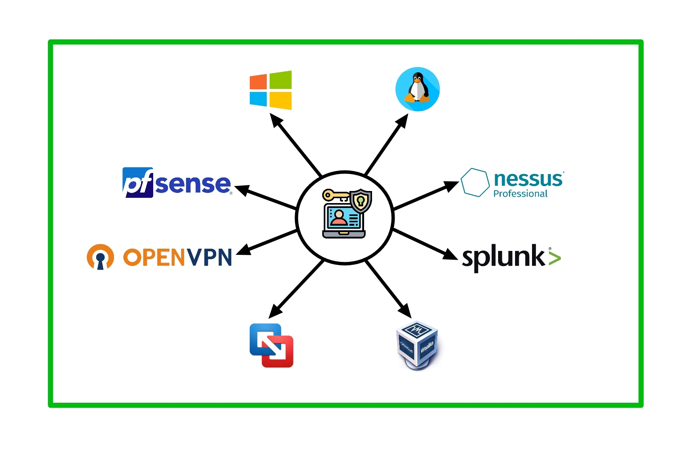

|  |  |  |  |  |  |  |
|:--:|:--:|:--:|:--:|:--:|:--:|:--:|

# Cybersecurity-HomeLab

This is a comprehensive cybersecurity home lab setup that integrates various technologies and configurations to enhance skills in:

- Network security
- Vulnerability detection
- Security auditing
- Incident analysis
